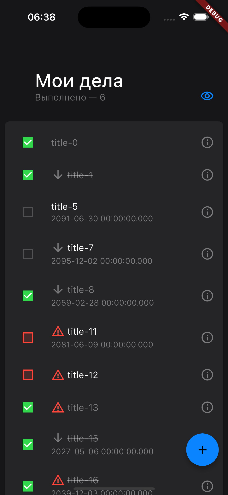
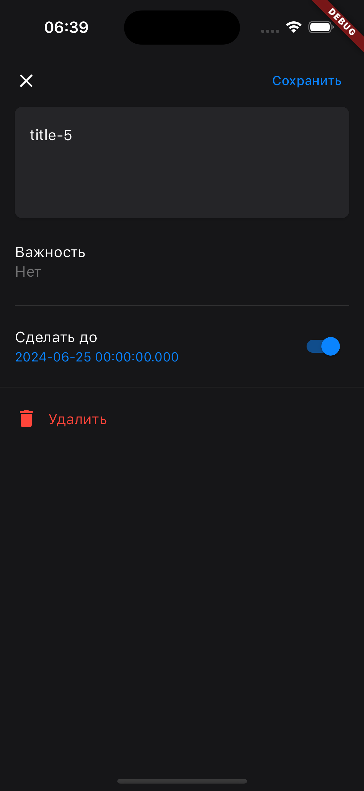

# yandex_todo_app

Учебный проект ШМР Яндекса по направлению Flutter.

В проекте используется разделение кода на фичи.

В проекте реализованы
- Визуальные части экранов списка задач и создания/редактирования задачи.
- Минимальный слой логики работы с задачами
- Логгер.

Для поддержки цветовой темы создано расширение ```CustomAppColors```.

Код отформатирован:
```
Formatted 22 files (0 changed) in 0.21 seconds.
Analyzing yandex_todo_app...                                            
No issues found! (ran in 1.1s)
```
|Экран списка задач|Экран создания/редактирования задачи|
|-|-|
|||

Ссылки на загрузку APK:
- [Первая версия (добавлена в пре-релиз на гитхаб)](https://github.com/eeeedgar/yandex_todo_app/releases/download/v0.0.0/app-release.apk)